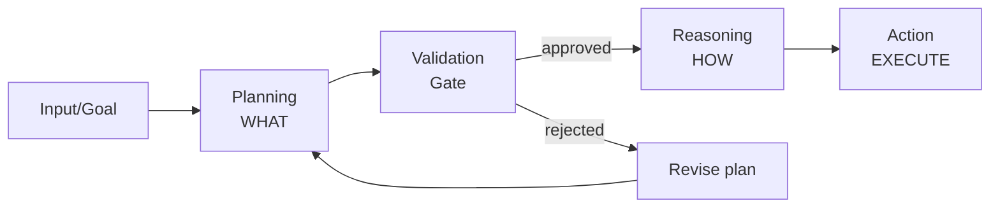

# Day 2 — Lesson 1: Agents trong SDLC

!!! abstract "Mục tiêu bài này"
    - Hiểu **agent** là gì trong context **Software Development Life Cycle (SDLC)**
    - Phân biệt 3 giai đoạn: **planning → reasoning → action**
    - Biết **inspectable artifacts** là gì + tại sao quan trọng
    - Định nghĩa **autonomy levels** + **human-in-the-loop**

    🇻🇳 **Hết bài này** bạn trả lời được: "Agent khác script tự động hoá như thế nào?" và "Tại sao phải tách planning khỏi action?"

    **Domain coverage**: 1.1 + 1.2 + 1.3 (toàn bộ Domain 1 sub-skills).
    **Time**: ~30 phút đọc + 15 phút self-check.

---

## 1. Concept: Integrate agents into SDLC

### English definition

> An **AI agent** is a system that **autonomously** performs steps inside an **SDLC workflow** — observing inputs, reasoning over them, choosing actions, and producing artifacts — with **bounded autonomy** and **inspectable outputs**.

### 🇻🇳 Giải thích

**SDLC** = Software Development Life Cycle = vòng đời phát triển phần mềm gồm các bước:

```
Plan → Design → Code → Test → Review → Build → Deploy → Monitor → Maintain
```

**Agent** không giống **script** ở 3 điểm chính:

| Khía cạnh | Script (bash/CI step) | Agent |
|---|---|---|
| Input | Cố định, schema rõ | Mơ hồ, ngôn ngữ tự nhiên |
| Decision | If-else viết tay | LLM suy luận tại runtime |
| Action set | Cố định | Có thể chọn tool động |
| Output | Deterministic | Probabilistic — phải validate |

!!! example "Ví dụ thực tế"
    - **Script**: GitHub Action chạy `npm test` mỗi PR
    - **Agent**: GitHub Copilot agent đọc PR, hiểu được "test nào liên quan đến code đã đổi", chạy chỉ những test đó, viết comment giải thích kết quả

### Steps agent có thể đảm nhận trong SDLC

| SDLC step | Agent task ví dụ |
|---|---|
| Plan | Phân tích issue → tạo task list |
| Design | Đề xuất kiến trúc + trade-offs |
| Code | Implement feature theo spec |
| Test | Sinh test cases, fix flaky test |
| Review | Review PR, flag issues |
| Build | Auto-fix lint, format |
| Deploy | Cấu hình env, run smoke test |
| Monitor | Phân tích log lỗi, suggest fix |

### Common anti-patterns (exam ưu tiên hỏi)

!!! danger "Anti-patterns to recognize"
    1. **No success criteria defined** — agent chạy nhưng không biết khi nào xong → vô tận hoặc dừng sai
    2. **Unbounded scope** — agent được phép edit toàn repo → blast radius lớn
    3. **No structured output** — agent trả prose dài → không thể assert pass/fail
    4. **No observability hooks** — agent fail mà không ai biết
    5. **Action without plan** — agent chạy luôn không show plan → reviewer không kịp can thiệp

### 💡 Exam tip

Câu hỏi dạng: "_Which is an anti-pattern when integrating agents into SDLC?_" — đáp án thường liên quan đến **1 trong 5 cái trên**. Nhớ pattern "no X, no Y" (no success criteria, no inspectable artifact).

---

## 2. Concept: Planning vs Reasoning vs Action separation

### English definition

> **Planning** = decide *what to do*. **Reasoning** = decide *how to do it*. **Action** = actually execute (call tools, write files, push commits). These three phases must be **distinct and inspectable**.

### 🇻🇳 Giải thích

3 giai đoạn — **bắt buộc tách rời**:



**Planning** = list các step (markdown / JSON structured plan)
**Reasoning** = với mỗi step, chọn tool nào, params gì
**Action** = thực sự gọi tool, sửa file, push commit

### Tại sao phải tách?

!!! tip "3 lý do critical"
    1. **Reviewability** — Reviewer (human/another agent) có thể duyệt plan **trước khi** action chạy. Plan sai sửa rẻ, action sai phải rollback.
    2. **Auditability** — Sau này debug, có plan + reasoning trace để biết "agent nghĩ gì lúc đó".
    3. **Safety** — Plan có thể chứa irreversible action (delete prod DB) → human approve gate trước action.

### Ví dụ mapping với Claude Code (bạn đã quen)

| Phase | Claude Code mapping |
|---|---|
| Planning | `architect` agent tạo TDD doc |
| Validation gate | User approve plan |
| Reasoning | `builder` agent quyết file nào sửa, dùng Edit/Write |
| Action | Edit/Write/Bash execute |
| Audit | git log + agent transcript |

### Anti-patterns

!!! danger "Common mistakes"
    - **Planning + Action cùng prompt** — agent vừa nghĩ vừa làm → không validate được
    - **Plan dạng prose dài** — không structured, khó assert/diff
    - **Skip validation gate** vì "agent đã giỏi rồi" — false confidence
    - **No replay** — agent chạy 2 lần ra 2 plan khác nhau, không deterministic

### 💡 Exam tip

GH-600 yêu cầu cấu hình agent **output a structured plan** + **prevent action until checked and approved**. Câu hỏi MCQ thường có 4 lựa chọn, 1 cái mô tả "agent thinks and acts together" → SAI. Đáp án đúng = "agent produces a plan, plan is validated, then agent executes."

---

## 3. Concept: Inspectable artifacts

### English definition

> An **inspectable artifact** is any **persistent output** of an agent that a human or another agent can **review later** to understand what happened.

### 🇻🇳 Giải thích

"Artifact" = sản phẩm phụ agent tạo ra trong lúc làm việc. "Inspectable" = đọc được, review được, không phải binary đen.

### Examples trong GitHub workflow

| Artifact | Format | Purpose |
|---|---|---|
| **PR description** | Markdown | Why agent đề xuất change này |
| **Plan file** (`PLAN.md`) | Markdown checklist | Steps agent định làm |
| **Reasoning trace** | JSON/log | Tool calls + params |
| **Test results** | JUnit XML / markdown | Pass/fail per case |
| **SARIF scan report** | JSON | Security findings |
| **Code review comments** | GitHub PR comments | Inline feedback |
| **Workflow run log** | Plain text | Step-by-step execution |
| **Audit log** | Append-only log | Who/what/when |

### 2 ví dụ cụ thể trong 1 PR

!!! example "PR do agent tạo — required artifacts"
    1. **PR body** chứa: "Plan: 5 steps. Refs: #123. Risk: low. Tests added: X."
    2. **Commit `.github/agent-logs/<run-id>.json`** chứa reasoning trace: mỗi step ghi tool nào được gọi, params, kết quả.

    → Reviewer có thể đọc cả 2 mà không cần chạy agent lại.

### 💡 Exam tip

"_Configure agent to produce inspectable artifacts within standard development tooling_" — keyword **standard development tooling** = GitHub PR, Issues, Actions, Checks. Không phải file riêng ở `/tmp/` hay log Slack. **Tất cả artifact phải nằm trong GitHub** để team thấy.

---

## 4. Concept: Autonomy levels + human-in-the-loop

### English definition

> **Autonomy level** = how much agent can do **without human approval**. **Human-in-the-loop (HITL)** = inserting a mandatory approval step before specific actions.

### 🇻🇳 Giải thích — thang autonomy 5 cấp

| Level | Tên | Mô tả | Ví dụ |
|---|---|---|---|
| **L0** | Suggest only | Agent chỉ propose, human làm | Copilot inline suggest |
| **L1** | Approve every action | Human approve TỪNG action | Chat-based, user click "yes" mỗi step |
| **L2** | Approve plan | Human approve plan, agent execute từng step trong plan | Claude Code `/build` workflow |
| **L3** | Approve PR | Agent tự run đến khi tạo PR, human review PR | Copilot cloud agent với CodeQL gate |
| **L4** | Approve only risky | Agent tự run, chỉ pause khi gặp irreversible action | Production deploy agent |
| **L5** | Full autonomous | Không có gate (chỉ dùng trong sandbox) | Research/eval env |

### Khi nào BẮT BUỘC có human gate (exam ưu tiên hỏi)

!!! warning "Mandatory HITL actions"
    1. **Irreversible operations**: `git push --force`, `DROP TABLE`, prod deploy
    2. **Security-sensitive**: secrets handling, auth config, role grants
    3. **Compliance-sensitive**: actions touching PHI/PII, GDPR data export
    4. **Cost-significant**: large LLM batch, infra scale-up
    5. **Cross-team blast radius**: changes to shared lib used by N teams

### 💡 Exam tip

"_Preserve execution velocity by minimizing approvals that do not materially reduce risk_" — đây là câu thường gặp. Nghĩa là **không phải action nào cũng cần approval**. Approval **chỉ ở chỗ rủi ro thật sự** (5 cái trên). Approve tất → chậm = bad design. Approve không gì → unsafe = bad design.

---

## 5. Tự kiểm tra (5 câu)

Trả lời ngắn 1–2 câu mỗi câu. Tự chấm bằng phần "Answers" cuối bài.

**Q1.** Agent của bạn được cấu hình để vừa generate plan vừa thực thi luôn trong 1 prompt. Vi phạm nguyên tắc nào? Hậu quả?

**Q2.** Liệt kê 3 inspectable artifacts mà 1 coding agent NÊN produce trong 1 PR.

**Q3.** Action nào của agent **BẮT BUỘC** đòi human approval bất kể autonomy level? (≥3)

**Q4.** Bạn thiết kế 1 agent fix lint error tự động merge vào main. Autonomy level nào hợp lý? Giải thích.

**Q5.** "_Configure agent to produce inspectable artifacts within standard development tooling_" — "standard development tooling" cụ thể là gì trong context GitHub?

??? success "Đáp án (mở khi đã làm xong)"
    **A1.** Vi phạm **planning/action separation**. Hậu quả: không validate được plan trước khi action, không rollback rẻ, không audit được "agent nghĩ gì". Reviewer không kịp can thiệp.

    **A2.** Bất kỳ 3 trong: PR description, PLAN.md/checklist, reasoning trace JSON, test results report, SARIF scan, workflow run log, code review comments, commit messages có cấu trúc.

    **A3.** 3+ trong: irreversible operations (force push, DROP TABLE, prod deploy), security-sensitive (secrets, auth, roles), compliance (PHI/PII export), cost-significant (large batch, infra scale), cross-team blast radius.

    **A4.** **L2 hoặc L3** — KHÔNG L4/L5. Lint fix nghe nhẹ nhưng merge thẳng main = irreversible nếu rebase. Nên: agent fix → PR → human approve → merge.

    **A5.** GitHub PR (body + comments), GitHub Issues, GitHub Actions logs + artifacts, GitHub Checks API, commit messages, files trong repo (PLAN.md, audit-log/). **KHÔNG** phải: Slack DM, `/tmp/` files, agent-private storage, email.

---

## 6. Lab nhỏ (optional, ~15 phút)

Mở repo `cleonhp88/gh-600-study` (chính cái bạn đang đọc), tạo 1 file ví dụ về **inspectable plan**:

```bash
cd ~/docs/certs/gh-600
mkdir -p docs/labs/01-inspectable-plan
```

Tạo file `docs/labs/01-inspectable-plan/PLAN-example.md` mô phỏng plan của 1 agent fix bug:

```markdown
# Agent Plan: Fix nullable user.email bug (#42)

## Success criteria
- [ ] `getUserEmail()` không throw khi email = null
- [ ] Unit test cover 3 case: valid, null, undefined
- [ ] Existing tests vẫn pass

## Steps
1. Read `src/user.ts` để xác định root cause
2. Implement fix bằng optional chaining
3. Add test case in `tests/user.test.ts`
4. Run `npm test` — all green
5. Open PR with this plan attached

## Risk assessment
- Blast radius: 1 file + 1 test file
- Reversibility: easy (single commit revert)
- Required approval: L3 (PR review)
```

→ Commit + push lên repo. Đây là **inspectable artifact** thực tế.

---

## 7. Next

!!! info "Bài tiếp theo"
    **Day 3 — Lesson 2 Domain 1**: Configure observability and control for autonomous agents
    (degree of autonomy, guardrails, inspection artifacts in standard tooling, non-blocking human intervention)

    → Hoặc nếu muốn nhảy sang **Domain 2 (Tools + MCP, weight 20–25%)** trước, báo mình.

!!! tip "Hành động ngay sau bài này"
    1. Trả lời 5 câu tự kiểm tra → so với đáp án → mark trong tracker
    2. (Optional) Làm lab tạo PLAN.md ví dụ
    3. Quay lại baseline quiz (`day-01-baseline.md`) — giờ chắc bạn trả lời tốt hơn Q1, Q2, Q11
