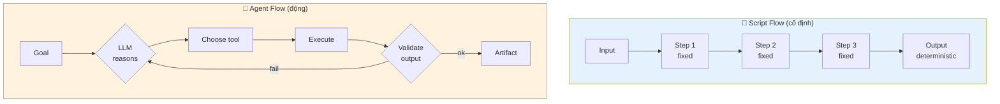
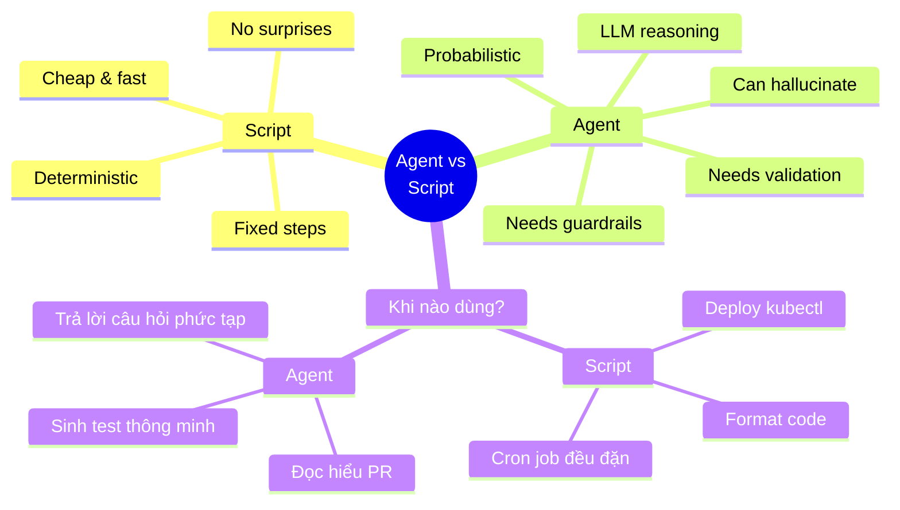

# 🤖 vs 📜 Agent khác Script chỗ nào?

!!! abstract "🎯 Mục tiêu (5 phút)"
    🇺🇸 _After this lesson, you'll know when to use an **agent** vs a **script** — a foundational concept on GH-600._

    🇻🇳 _Sau bài này, bạn biết khi nào dùng **agent** (tác nhân AI tự quyết) và khi nào dùng **script** (kịch bản cố định) — khái niệm nền tảng exam GH-600._

---

## 1. So sánh trực quan

<div class="grid cards" markdown>

-   :material-script-text:{ .lg .middle } **📜 Script**

    ---

    🇺🇸 _Fixed steps. Same input → same output._

    🇻🇳 _Các bước cố định. Cùng input thì luôn ra cùng output._

    **Ví dụ**: `npm test`, `kubectl apply`, GitHub Action chạy theo `if-else` cứng.

-   :material-robot-happy:{ .lg .middle } **🤖 Agent**

    ---

    🇺🇸 _Decides at runtime which tool to call, validates output._

    🇻🇳 _Tự quyết tại runtime (lúc chạy) dùng tool nào, tự kiểm tra kết quả._

    **Ví dụ**: GitHub Copilot đọc PR rồi chọn test nào chạy.

</div>

---

## 2. Analogy đời thật 🍳

<div class="grid cards" markdown>

-   :material-book-open-variant:{ .lg .middle } **📜 Script = Công thức nấu ăn**

    ---

    🇺🇸 _A recipe lists exact steps. Missing an ingredient? It fails._

    🇻🇳 _Công thức ghi rõ từng bước. Thiếu nguyên liệu là toi._

-   :material-chef-hat:{ .lg .middle } **🤖 Agent = Đầu bếp**

    ---

    🇺🇸 _A chef opens the fridge, decides the menu, substitutes ingredients._

    🇻🇳 _Đầu bếp mở tủ lạnh, tự nghĩ món, thiếu thì thay nguyên liệu khác._

</div>

!!! tip "Câu để nhớ"
    🇺🇸 _**Script obeys; agent decides.**_

    🇻🇳 _**Script tuân lệnh; agent quyết định.**_

---

## 3. Luồng xử lý — Script vs Agent



🇺🇸 _Script has a fixed path. Agent has a **decision loop** (reason → tool → validate) until success._

🇻🇳 _Script chạy theo đường thẳng. Agent chạy theo **vòng lặp quyết định** (suy luận → chọn tool → kiểm tra) cho tới khi thành công._

---

## 4. Bảng so sánh kỹ thuật

| Khía cạnh | 📜 Script | 🤖 Agent |
|---|---|---|
| **Input** | Schema cố định (định dạng cụ thể) | Natural language (ngôn ngữ tự nhiên) |
| **Decision** | `if-else` viết tay | LLM reasoning (LLM suy luận) tại runtime |
| **Tools** | 1–2 lệnh hardcoded | Chọn động từ nhiều tool |
| **Output** | Deterministic (cố định) | Probabilistic (xác suất, có thể đổi) |
| **Cost** | Rẻ, nhanh | Đắt, chậm hơn |
| **Failure** | Crash với error rõ | Có thể **hallucinate** (bịa kết quả sai như thật) |

!!! warning "Từ vựng exam"
    🇺🇸 _"**Hallucinate**" = the agent produces a confident but wrong answer._

    🇻🇳 _"**Hallucinate**" = agent trả lời chắc nịch nhưng sai (bịa). Đây là rủi ro lớn nhất khi dùng agent — phải có guardrails (rào chắn) để chặn._

---

## 5. Mindmap khái niệm



---

## 6. Ví dụ cụ thể: "Chạy test sau mỗi PR"

=== "📜 Script (GitHub Action thuần)"

    ```yaml
    name: CI
    on: pull_request
    jobs:
      test:
        runs-on: ubuntu-latest
        steps:
          - uses: actions/checkout@v4
          - run: npm install
          - run: npm test     # Chạy TOÀN BỘ test, mọi lần
    ```

    🇺🇸 _Runs all tests every time. No reasoning. Cheap and predictable._

    🇻🇳 _Chạy hết test mọi lần. Không suy luận. Rẻ và dễ đoán._

=== "🤖 Agent (Copilot agent)"

    ```yaml
    # Agent đọc PR diff
    # → hiểu file nào đã đổi
    # → chọn TEST liên quan để chạy
    # → nếu fail → đọc log → suggest fix
    # → comment giải thích lên PR
    ```

    🇺🇸 _Smarter but needs guardrails: timeout, scope, approval for risky actions._

    🇻🇳 _Thông minh hơn nhưng cần rào chắn: giới hạn thời gian, giới hạn phạm vi, cần approve cho hành động rủi ro._

---

## 7. ⚡ Mini-quiz (30 giây)

**Q1.**
🇺🇸 _When should you use a **script** instead of an agent?_

🇻🇳 _Khi nào nên dùng **script** thay vì agent?_

??? success "Đáp án"
    🇺🇸 _When the flow is fixed, the input schema is known, and no reasoning is needed. Examples: code formatting, kubectl deploy, scheduled cron jobs. Using an agent here wastes money and adds hallucination risk._

    🇻🇳 _Khi luồng cố định, input schema rõ, không cần suy luận. Ví dụ: format code, deploy kubectl, cron job định kỳ. Dùng agent ở đây = tốn tiền + thêm rủi ro hallucinate (bịa)._

**Q2.**
🇺🇸 _Why must agent output be **validated** while script output usually isn't?_

🇻🇳 _Tại sao output của agent phải được **validate** (kiểm chứng) còn script thì thường không cần?_

??? success "Đáp án"
    🇺🇸 _Because agents are **probabilistic** — two runs can give two different results, or look correct but be wrong (hallucination). You need a gate: schema check, test pass, or human approval. Scripts are deterministic, so the output is trustworthy by construction._

    🇻🇳 _Vì agent **probabilistic** (xác suất) — 2 lần chạy có thể ra 2 kết quả khác, hoặc trông đúng mà sai (hallucination). Phải có cổng kiểm: schema check, test pass, hoặc human approval. Script deterministic (cố định) nên output tin được luôn._

---

## 8. 🔑 Take-away

!!! success "Câu chốt"
    🇺🇸 _**Script = obey, cheap, safe. Agent = decide, expensive, needs guardrails.**_

    🇻🇳 _**Script = tuân lệnh, rẻ, an toàn. Agent = suy luận, đắt, cần rào chắn.**_

    🇺🇸 _Exam pattern: "given this situation, which one fits?"_

    🇻🇳 _Câu hỏi exam thường ẩn ý: "tình huống này hợp với cái nào?"_

---

[← Trang chủ](../../index.md){ .md-button }

!!! note "Bài tiếp theo"
    **1.2 SDLC là gì + agent ngồi ở đâu?** — đang chờ bạn confirm format này. Sau khi OK, mình build 7 bài còn lại liền mạch.
