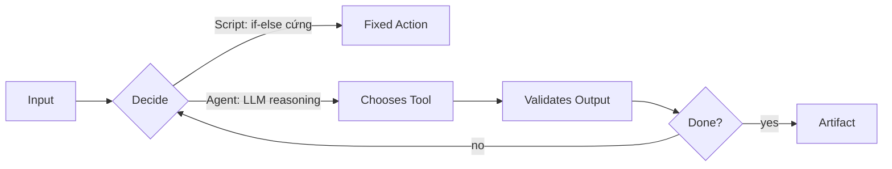

# 🤖 vs 📜 Agent khác Script chỗ nào?

!!! abstract "🎯 Sau 5 phút bạn sẽ biết..."
    Khi nào dùng **agent**, khi nào dùng **script** — và vì sao exam GH-600 gọi đây là khái niệm nền tảng.

---

## 🍳 Analogy đời thật

| 📜 **Script** | 🤖 **Agent** |
|---|---|
| Công thức nấu ăn ghi sẵn | Đầu bếp đọc tủ lạnh, tự nấu |
| Bước 1, 2, 3 cố định | Tự quyết bước tiếp theo |
| Thiếu nguyên liệu → fail | Thiếu nguyên liệu → thay thế |
| Lặp 100 lần ra y hệt | 100 lần ra 100 kiểu (khác chút) |

🇻🇳 **Nhớ 1 câu**: Script làm theo lệnh, agent **quyết định**.

---

## 📊 So sánh kỹ thuật



| Khía cạnh | 📜 Script | 🤖 Agent |
|---|---|---|
| **Input** | Schema cố định | Ngôn ngữ tự nhiên |
| **Decision** | `if-else` viết tay | LLM suy luận runtime |
| **Tools** | Cố định 1–2 lệnh | Chọn động từ nhiều tool |
| **Output** | Deterministic | Probabilistic — phải validate |
| **Cost** | Rẻ, nhanh | Đắt, chậm hơn |
| **Failure** | Crash với message rõ | Có thể "trông như đúng" (hallucinate) |

---

## 💻 Ví dụ cụ thể: "Chạy test sau mỗi PR"

=== "📜 Script (GitHub Action)"

    ```yaml
    name: CI
    on: pull_request
    jobs:
      test:
        runs-on: ubuntu-latest
        steps:
          - uses: actions/checkout@v4
          - run: npm install
          - run: npm test     # Chạy TOÀN BỘ test, luôn
    ```

    **Hành vi**: chạy hết. Pass hay fail → comment generic.

=== "🤖 Agent (Copilot)"

    ```yaml
    # Agent đọc PR diff → hiểu file nào đổi
    # → chạy CHỈ test liên quan
    # → nếu fail, đọc log → suggest fix
    # → comment giải thích chi tiết
    ```

    **Hành vi**: thông minh hơn nhưng cần guardrails (Domain 6) để khỏi loạn.

---

## ⚡ Mini-quiz (30 giây — đáp án mở ngay)

**Q1.** Trường hợp nào nên dùng **script**, không cần agent?

??? success "Đáp án"
    Khi luồng cố định, input schema rõ, không cần suy luận. Ví dụ: format code, deploy bằng `kubectl apply`, gửi Slack notification cố định template. Agent ở đây = **lãng phí** (đắt + thêm rủi ro hallucinate).

**Q2.** Tại sao agent output phải **validate** mà script thì không?

??? success "Đáp án"
    Vì agent **probabilistic** — 2 lần chạy có thể ra 2 kết quả khác nhau, hoặc trông đúng nhưng sai (hallucination). Phải có gate: schema check, test pass, hoặc human approval. Script deterministic → tin được output.

---

## 🔑 Take-away

> **Script** = lệnh cứng, chắc, rẻ. **Agent** = suy luận, mềm, đắt, cần guardrails.
> Câu hỏi exam thường ẩn ý: "đây là tình huống nên dùng cái nào?"

---

[← Trang chủ](../../index.md){ .md-button }

!!! note "Bài tiếp theo"
    **1.2 SDLC là gì + agent ngồi ở đâu?** — đang xây dựng. Khi bạn confirm format này OK, mình build tiếp ~7 bài còn lại của Foundations.
