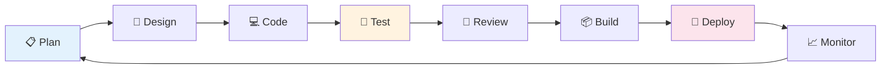

# 🔁 SDLC là gì + agent ngồi ở đâu?

!!! abstract "🎯 Mục tiêu (5 phút)"
    🇺🇸 _Understand the **Software Development Life Cycle (SDLC)** and where agents add value at each stage._

    🇻🇳 _Hiểu **SDLC (Vòng đời phát triển phần mềm)** và nơi agent có giá trị ở mỗi giai đoạn._

---

## 1. SDLC = vòng đời phần mềm

🇺🇸 _The SDLC is a continuous loop: plan → code → ship → learn → repeat._

🇻🇳 _SDLC là vòng lặp liên tục: lên kế hoạch → code → ship → học từ thực tế → làm lại._

---

## 2. Agent ngồi được ở đâu?

-   :material-clipboard-list:{ .lg } **📋 Plan**

    ---

    🇺🇸 _Agent reads an issue, drafts a task list._

    🇻🇳 _Agent đọc issue, phác thảo danh sách task._

-   :material-palette:{ .lg } **🎨 Design**

    ---

    🇺🇸 _Agent suggests architecture + trade-offs._

    🇻🇳 _Agent gợi ý kiến trúc + phân tích đánh đổi._

-   :material-code-tags:{ .lg } **💻 Code**

    ---

    🇺🇸 _Agent implements feature from spec._

    🇻🇳 _Agent viết code theo spec._

-   :material-test-tube:{ .lg } **🧪 Test**

    ---

    🇺🇸 _Agent generates test cases, fixes flaky tests._

    🇻🇳 _Agent sinh test cases, fix test flaky (chập chờn)._

-   :material-eye:{ .lg } **👀 Review**

    ---

    🇺🇸 _Agent reviews PR, flags issues._

    🇻🇳 _Agent review PR, gắn cờ vấn đề._

-   :material-package:{ .lg } **📦 Build**

    ---

    🇺🇸 _Agent auto-fixes lint, formatting._

    🇻🇳 _Agent tự fix lint, format code._

-   :material-rocket-launch:{ .lg } **🚀 Deploy**

    ---

    🇺🇸 _Agent configures environment, runs smoke tests._

    🇻🇳 _Agent cấu hình môi trường, chạy smoke test._

-   :material-chart-line:{ .lg } **📈 Monitor**

    ---

    🇺🇸 _Agent analyzes error logs, suggests root cause._

    🇻🇳 _Agent phân tích log lỗi, gợi ý nguyên nhân gốc._

---

## 3. ⚠️ Anti-pattern: agent ở MỌI giai đoạn

!!! danger "Cảnh báo"
    🇺🇸 _Putting an agent at every single stage creates noise: hallucinations propagate, costs explode, debugging becomes impossible._

    🇻🇳 _Nhét agent vào mọi giai đoạn = hỗn loạn: hallucination lan truyền, chi phí bùng nổ, debug bất khả thi._

    🇺🇸 _**Rule of thumb**: use agents where reasoning matters, scripts where determinism matters._

    🇻🇳 _**Nguyên tắc**: dùng agent ở nơi cần suy luận, dùng script ở nơi cần chắc chắn._

---

## 4. ⚡ Mini-quiz (30 giây)

**Q1.**
🇺🇸 _Name 3 SDLC stages where an agent typically adds the most value._

🇻🇳 _Kể 3 giai đoạn SDLC mà agent thường mang lại giá trị nhất._

??? success "Đáp án"
    🇺🇸 _Most-cited: **Code** (implementing from spec), **Review** (reading PR + reasoning about quality), **Monitor** (parsing logs and suggesting root causes). These need reasoning, not just execution._

    🇻🇳 _3 nơi điển hình: **Code** (viết theo spec), **Review** (đọc PR + suy luận chất lượng), **Monitor** (đọc log + đoán nguyên nhân). Đây là các nơi cần **suy luận**, không chỉ thực thi._

**Q2.**
🇺🇸 _Why is putting an agent at every SDLC stage usually a bad idea?_

🇻🇳 _Tại sao nhét agent vào mọi giai đoạn SDLC thường là ý tệ?_

??? success "Đáp án"
    🇺🇸 _Hallucinations compound across stages, cost grows linearly, audit trails become unmanageable. Use deterministic scripts where the flow is fixed._

    🇻🇳 _Hallucination cộng dồn qua các giai đoạn, chi phí tăng tuyến tính, audit trail rối loạn. Dùng script deterministic ở chỗ luồng cố định._

---

## 5. 🔑 Take-away

!!! success "Câu chốt"
    🇺🇸 _**SDLC = loop. Agents fit where reasoning matters; scripts fit where determinism matters.**_

    🇻🇳 _**SDLC = vòng lặp. Agent phù hợp nơi cần suy luận; script phù hợp nơi cần chắc chắn.**_

---

[← 1.1](01-agent-vs-script.md){ .md-button } [Tiếp: 1.3 Plan/Reason/Action →](03-planning-reasoning-action.md){ .md-button .md-button--primary }
