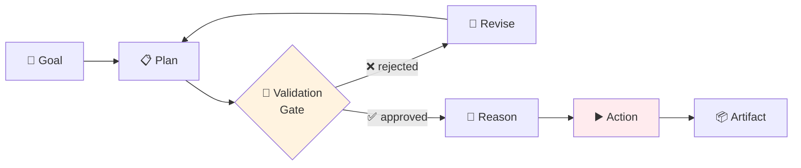

# 🧠 3 nhịp riêng: Planning → Reasoning → Action

!!! abstract "🎯 Mục tiêu (5 phút)"
    🇺🇸 _Understand why agents must separate **planning**, **reasoning**, and **action** into distinct phases._

    🇻🇳 _Hiểu vì sao agent phải tách **planning** (lên kế hoạch), **reasoning** (suy luận cách làm), **action** (thực thi) thành 3 giai đoạn riêng._

---

## 1. 3 nhịp — phân biệt rõ

-   :material-clipboard-list-outline:{ .lg } **📋 Planning**

    ---

    🇺🇸 _What to do — the **list of steps**._

    🇻🇳 _Làm GÌ — **danh sách các bước**._

-   :material-brain:{ .lg } **🧠 Reasoning**

    ---

    🇺🇸 _How to do it — **choosing tools & params**._

    🇻🇳 _Làm THẾ NÀO — **chọn tool nào, params gì**._

-   :material-play-circle:{ .lg } **▶️ Action**

    ---

    🇺🇸 _Actually execute — **call tools, write files, push commits**._

    🇻🇳 _Thực sự chạy — **gọi tool, sửa file, push commit**._

---

## 2. Luồng chuẩn — có gate

🇺🇸 _The validation gate is the critical insight: a human or automated check approves the plan **before** any side-effect happens._

🇻🇳 _Validation gate (cổng kiểm tra) là điểm mấu chốt: người hoặc check tự động duyệt plan **trước khi** có bất kỳ thay đổi nào xảy ra._

---

## 3. Tại sao phải tách? — 3 lý do

-   :material-eye-check:{ .lg } **🔍 Reviewability**

    ---

    🇺🇸 _A plan is cheap to fix; a wrong action requires rollback._

    🇻🇳 _Plan sai sửa rẻ; action sai phải rollback (lùi lại) tốn kém._

-   :material-shield-check:{ .lg } **🛡️ Safety**

    ---

    🇺🇸 _Insert human approval before irreversible steps (force push, drop DB)._

    🇻🇳 _Chèn human approval trước hành động không hoàn tác được (force push, xóa DB)._

-   :material-history:{ .lg } **📜 Auditability**

    ---

    🇺🇸 _The plan + reasoning trace tells you what the agent thought, later._

    🇻🇳 _Plan + reasoning trace cho bạn biết "agent nghĩ gì lúc đó" để debug sau._

---

## 4. ⚠️ Anti-pattern: blend cả 3

!!! danger "Anti-pattern"
    🇺🇸 _Asking the agent "**fix this bug**" and letting it plan + reason + act in one shot — no validation gate, no audit trail, hard to recover from mistakes._

    🇻🇳 _Hỏi agent "**fix bug này**" và để nó tự plan + reason + act trong 1 lần — không gate, không audit, hỏng là rất khó cứu._

---

## 5. ⚡ Mini-quiz (30 giây)

**Q1.**
🇺🇸 _Why separate planning from action?_

🇻🇳 _Tại sao phải tách planning khỏi action?_

??? success "Đáp án"
    🇺🇸 _**Reviewability** (plan can be inspected before harm), **safety** (insert approval gate), **auditability** (trace decisions later)._

    🇻🇳 _**Reviewability** (plan kiểm tra được trước khi gây hại), **safety** (chèn cổng approve), **auditability** (lưu vết quyết định để debug)._

**Q2.**
🇺🇸 _What is a **validation gate** in this context?_

🇻🇳 _**Validation gate** trong ngữ cảnh này là gì?_

??? success "Đáp án"
    🇺🇸 _A checkpoint between plan and action where the plan is reviewed (by a human, another agent, or automated check) before execution proceeds._

    🇻🇳 _Một checkpoint giữa plan và action, nơi plan được duyệt (bởi người, agent khác, hoặc kiểm tra tự động) trước khi action chạy._

---

## 6. 🔑 Take-away

!!! success "Câu chốt"
    🇺🇸 _**Plan → Validate → Act. Never blend them.**_

    🇻🇳 _**Lên kế hoạch → Duyệt → Thực thi. Không bao giờ gộp chung.**_

---

[← 1.2](02-sdlc-where-agent-fits.md){ .md-button } [Tiếp: 1.4 Inspectable artifacts →](04-inspectable-artifacts.md){ .md-button .md-button--primary }
