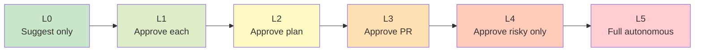

# 🎚️ Autonomy levels — 6 cấp tự chủ

!!! abstract "🎯 Mục tiêu (5 phút)"
    🇺🇸 _Learn the 6 levels of agent autonomy and how to pick the right one for a task._

    🇻🇳 _Học 6 cấp tự chủ của agent và cách chọn cấp phù hợp cho từng task._

---

## 1. Thang autonomy

🇺🇸 _As autonomy increases, speed goes up but safety controls must scale too._

🇻🇳 _Càng tăng autonomy thì càng nhanh, nhưng phải tăng kiểm soát an toàn tương ứng._

---

## 2. Chi tiết 6 cấp

-   :material-numeric-0-circle:{ .lg } **L0 — Suggest only**

    ---

    🇺🇸 _Agent proposes; human does everything._

    🇻🇳 _Agent gợi ý; con người làm tất cả._

    **Ví dụ**: Copilot inline suggest.

-   :material-numeric-1-circle:{ .lg } **L1 — Approve each action**

    ---

    🇺🇸 _Human clicks "yes" for every single action._

    🇻🇳 _Con người click "đồng ý" cho từng hành động._

    **Ví dụ**: Chat-based với confirm mỗi bước.

-   :material-numeric-2-circle:{ .lg } **L2 — Approve plan**

    ---

    🇺🇸 _Human approves the plan; agent executes all steps._

    🇻🇳 _Con người duyệt plan; agent chạy hết các bước._

    **Ví dụ**: Claude Code `/build` workflow.

-   :material-numeric-3-circle:{ .lg } **L3 — Approve PR**

    ---

    🇺🇸 _Agent works until PR is opened; human reviews PR._

    🇻🇳 _Agent làm đến khi tạo PR; con người review PR._

    **Ví dụ**: Copilot cloud agent với CodeQL gate.

-   :material-numeric-4-circle:{ .lg } **L4 — Approve only risky**

    ---

    🇺🇸 _Agent runs free; pauses only for irreversible actions._

    🇻🇳 _Agent tự chạy; chỉ dừng lại cho hành động không thể hoàn tác._

    **Ví dụ**: Deploy agent dừng trước prod migration.

-   :material-numeric-5-circle:{ .lg } **L5 — Full autonomous**

    ---

    🇺🇸 _No gates. Only safe in a sandbox._

    🇻🇳 _Không có cổng nào. Chỉ an toàn trong sandbox._

    **Ví dụ**: Research/eval environment.

---

## 3. Chọn level nào?

| Task | Level đề xuất | Lý do |
|---|---|---|
| Fix typo trong docs | L3 | PR review là đủ |
| Add feature mới | L2 | Plan cần duyệt trước |
| Deploy lên prod | L4 | Chỉ dừng ở migration risky |
| Run security scan | L5 | Read-only, không phá gì |
| Touch billing config | L1 | Mỗi action approve |

🇺🇸 _**Rule**: higher risk → lower autonomy._

🇻🇳 _**Nguyên tắc**: rủi ro càng cao thì autonomy càng thấp._

---

## 4. ⚡ Mini-quiz (30 giây)

**Q1.**
🇺🇸 _An agent auto-fixes lint and merges to main. What autonomy level fits?_

🇻🇳 _Agent tự fix lint và merge vào main. Autonomy level nào hợp lý?_

??? success "Đáp án"
    🇺🇸 _**L2 or L3** — NOT L4/L5. Even "small" lint fixes touching main need PR review (the rebase is irreversible)._

    🇻🇳 _**L2 hoặc L3** — KHÔNG L4/L5. Lint fix nghe nhẹ nhưng merge thẳng main = irreversible nếu rebase. PR review là tối thiểu._

**Q2.**
🇺🇸 _Why is L5 (full autonomous) rarely safe in production?_

🇻🇳 _Tại sao L5 (full autonomous) hiếm khi an toàn ở prod?_

??? success "Đáp án"
    🇺🇸 _No human gate means hallucinations or bad decisions ship directly. Use L5 only where actions are read-only or contained (sandbox)._

    🇻🇳 _Không có cổng con người → hallucination hoặc quyết định tệ ship thẳng. Chỉ dùng L5 khi hành động read-only hoặc cô lập (sandbox)._

---

## 5. 🔑 Take-away

!!! success "Câu chốt"
    🇺🇸 _**Pick the lowest autonomy that still delivers value at acceptable speed.**_

    🇻🇳 _**Chọn autonomy thấp nhất mà vẫn giao giá trị ở tốc độ chấp nhận được.**_

---

[← 1.4](04-inspectable-artifacts.md){ .md-button } [Tiếp: 1.6 Human-in-the-loop →](06-human-in-the-loop.md){ .md-button .md-button--primary }
