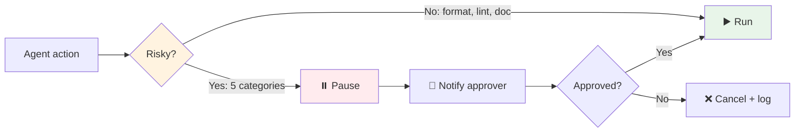

# 🙋 Human-in-the-loop (HITL) — 5 lúc bắt buộc

!!! abstract "🎯 Mục tiêu (5 phút)"
    🇺🇸 _Identify the 5 categories of actions that **always** require human approval, regardless of autonomy level._

    🇻🇳 _Nhận diện 5 nhóm hành động **luôn luôn** cần human approval, bất kể autonomy level cao bao nhiêu._

---

## 1. Quy tắc vàng

!!! quote ""
    🇺🇸 _**Preserve execution velocity by minimizing approvals that do not materially reduce risk.**_

    🇻🇳 _**Giữ tốc độ thực thi bằng cách tối thiểu các approval không thật sự giảm rủi ro.**_

    🇺🇸 _Translation: don't ask permission for everything; ask only where risk is real._

    🇻🇳 _Dịch: đừng hỏi xin phép cho mọi thứ; chỉ hỏi ở chỗ rủi ro thật sự._

---

## 2. 5 nhóm BẮT BUỘC có gate

-   :material-undo-variant:{ .lg } **♻️ Irreversible**

    ---

    🇺🇸 _Actions that can't be undone._

    🇻🇳 _Hành động không thể hoàn tác._

    **Ví dụ**: `git push --force`, `DROP TABLE`, prod deploy.

-   :material-shield-lock:{ .lg } **🔐 Security-sensitive**

    ---

    🇺🇸 _Touching secrets, auth, roles, permissions._

    🇻🇳 _Chạm vào secret, auth, role, quyền._

    **Ví dụ**: rotate API key, grant admin role.

-   :material-gavel:{ .lg } **⚖️ Compliance-sensitive**

    ---

    🇺🇸 _Actions touching regulated data (PHI, PII, GDPR)._

    🇻🇳 _Chạm dữ liệu bị quản chế (PHI, PII, GDPR)._

    **Ví dụ**: export user data, delete patient record.

-   :material-cash-multiple:{ .lg } **💰 Cost-significant**

    ---

    🇺🇸 _Large LLM batch, infra scale-up, expensive API calls._

    🇻🇳 _LLM batch lớn, scale infra, gọi API đắt._

    **Ví dụ**: process 1M items, spin up 100 GPUs.

-   :material-account-multiple:{ .lg } **👥 Cross-team blast radius**

    ---

    🇺🇸 _Changes that affect many teams or shared infra._

    🇻🇳 _Change ảnh hưởng nhiều team hoặc infra dùng chung._

    **Ví dụ**: edit shared lib, change CI base image.

---

## 3. Workflow chuẩn — non-blocking approval

🇺🇸 _The goal: gate only the risky 5–10% of actions; let the safe 90–95% run freely._

🇻🇳 _Mục tiêu: chỉ gate 5–10% hành động rủi ro; để 90–95% an toàn chạy thoải mái._

---

## 4. ⚠️ 2 anti-patterns thường gặp

!!! danger "Anti-pattern A — Gate EVERYTHING"
    🇺🇸 _Approval required for every action → team becomes a bottleneck, velocity dies._

    🇻🇳 _Approve cho mọi hành động → team thành bottleneck, tốc độ chết._

!!! danger "Anti-pattern B — Gate NOTHING"
    🇺🇸 _Trust the agent completely → first hallucination on a risky action = incident._

    🇻🇳 _Tin agent 100% → lần hallucinate đầu tiên ở chỗ rủi ro = sự cố._

---

## 5. ⚡ Mini-quiz (30 giây)

**Q1.**
🇺🇸 _List 3 categories of actions that always require human approval._

🇻🇳 _Kể 3 nhóm hành động luôn cần human approval._

??? success "Đáp án"
    🇺🇸 _Any 3 of: irreversible, security-sensitive, compliance-sensitive, cost-significant, cross-team blast radius._

    🇻🇳 _3 bất kỳ trong: irreversible (không hoàn tác), security-sensitive, compliance-sensitive, cost-significant, cross-team blast radius._

**Q2.**
🇺🇸 _What's the principle behind "minimize approvals that don't materially reduce risk"?_

🇻🇳 _Nguyên tắc "tối thiểu approval không giảm rủi ro thật sự" có nghĩa là gì?_

??? success "Đáp án"
    🇺🇸 _Approvals cost velocity. Each approval must be justified by real risk reduction. Reviewing safe actions (format, lint, doc) wastes everyone's time._

    🇻🇳 _Approval tốn tốc độ. Mỗi approval phải xứng đáng — giảm rủi ro thật. Review hành động an toàn (format, lint, doc) là phí thời gian._

---

## 6. 🔑 Take-away

!!! success "Câu chốt"
    🇺🇸 _**Gate risky actions, free safe ones. Speed AND safety, not one or the other.**_

    🇻🇳 _**Gate hành động rủi ro, thả hành động an toàn. Tốc độ VÀ an toàn, không phải chọn 1.**_

---

[← 1.5](05-autonomy-levels.md){ .md-button } [Tiếp: 1.7 Anti-patterns →](07-anti-patterns.md){ .md-button .md-button--primary }
