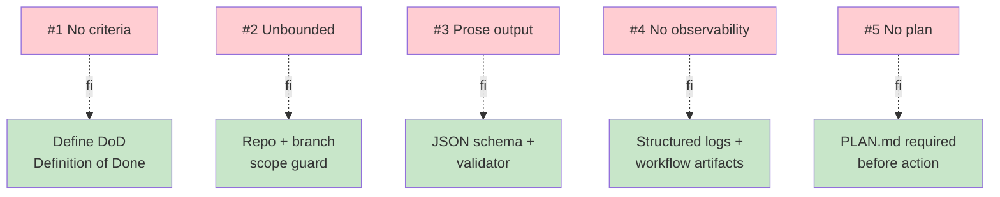

# ⚠️ 5 anti-patterns khi tích hợp agent

!!! abstract "🎯 Mục tiêu (5 phút)"
    🇺🇸 _Memorize the 5 most common anti-patterns when integrating agents into SDLC. Exam loves these._

    🇻🇳 _Học thuộc 5 anti-pattern phổ biến nhất khi tích hợp agent vào SDLC. Exam rất hay hỏi._

---

## 1. Tổng quan

-   :material-target-account:{ .lg } **🎯 #1 — No success criteria**

    ---

    🇺🇸 _Agent runs forever because "done" was never defined._

    🇻🇳 _Agent chạy mãi vì không định nghĩa "xong" là gì._

-   :material-bomb:{ .lg } **💣 #2 — Unbounded scope**

    ---

    🇺🇸 _Agent can edit any file in any repo._

    🇻🇳 _Agent được phép sửa bất kỳ file nào trong repo._

-   :material-text-long:{ .lg } **📃 #3 — No structured output**

    ---

    🇺🇸 _Agent returns long prose; impossible to assert pass/fail._

    🇻🇳 _Agent trả về văn xuôi dài; không assert pass/fail được._

-   :material-radar:{ .lg } **📡 #4 — No observability**

    ---

    🇺🇸 _Agent fails silently; no logs, no alerts._

    🇻🇳 _Agent lỗi âm thầm; không log, không cảnh báo._

-   :material-flash:{ .lg } **⚡ #5 — Action without plan**

    ---

    🇺🇸 _Agent jumps straight to action; no review possible._

    🇻🇳 _Agent nhảy thẳng vào action; không thể review được._

---

## 2. Phòng tránh từng cái

---

## 3. Ví dụ cụ thể từng anti-pattern

### #1 — No success criteria

🇺🇸 _Prompt: "Improve this code." → agent rewrites forever, never satisfies anyone._

🇻🇳 _Prompt: "Cải thiện code này." → agent viết lại mãi, không bao giờ vừa lòng ai._

**Fix**: define checklist — "all tests pass + cyclomatic complexity < 10 + no new deps."

### #2 — Unbounded scope

🇺🇸 _Agent given full repo write access → starts editing unrelated files._

🇻🇳 _Agent được quyền write toàn repo → bắt đầu sửa file không liên quan._

**Fix**: scope to branch + specific path glob (e.g. `src/auth/**`).

### #3 — No structured output

🇺🇸 _Agent returns: "I made some changes. Hope it helps!" → can't grep, can't assert._

🇻🇳 _Agent trả về: "Tôi đã sửa vài chỗ. Mong giúp được!" → không grep, không assert được._

**Fix**: require JSON output with `{status, files_changed[], tests_added[], risks[]}`.

### #4 — No observability

🇺🇸 _Agent crashes; no one notices for 3 days._

🇻🇳 _Agent crash; 3 ngày sau mới có người để ý._

**Fix**: structured logs + workflow_run notification + dead-letter queue.

### #5 — Action without plan

🇺🇸 _Agent immediately commits + pushes → reviewer sees fait accompli._

🇻🇳 _Agent commit + push ngay → reviewer thấy chuyện đã rồi._

**Fix**: 2-phase prompt: "First output plan, wait for approval, then execute."

---

## 4. ⚡ Mini-quiz (30 giây)

**Q1.**
🇺🇸 _An agent task says "improve this codebase" — which anti-pattern?_

🇻🇳 _Task agent ghi "cải thiện codebase này" — vi phạm anti-pattern nào?_

??? success "Đáp án"
    🇺🇸 _**#1 No success criteria** — "improve" is undefined. Agent runs forever or stops randomly._

    🇻🇳 _**#1 No success criteria** — "cải thiện" không định nghĩa được. Agent chạy mãi hoặc dừng tùy hứng._

**Q2.**
🇺🇸 _An agent edits production config without logging anywhere. Which anti-pattern?_

🇻🇳 _Agent sửa config prod mà không log đâu cả. Vi phạm anti-pattern nào?_

??? success "Đáp án"
    🇺🇸 _**#4 No observability** — and probably **#2 unbounded scope** too (prod config shouldn't be in agent reach without gate)._

    🇻🇳 _**#4 No observability** — và có thể cả **#2 unbounded scope** (config prod không nên trong tầm với của agent không có gate)._

---

## 5. 🔑 Take-away

!!! success "Câu chốt"
    🇺🇸 _**Define success, scope tightly, output structured data, log everything, plan before acting.**_

    🇻🇳 _**Định nghĩa thành công, gò scope chặt, output có cấu trúc, log mọi thứ, plan trước khi act.**_

---

[← 1.6](06-human-in-the-loop.md){ .md-button } [Tiếp: 1.8 Recap quiz →](08-recap-quiz.md){ .md-button .md-button--primary }
